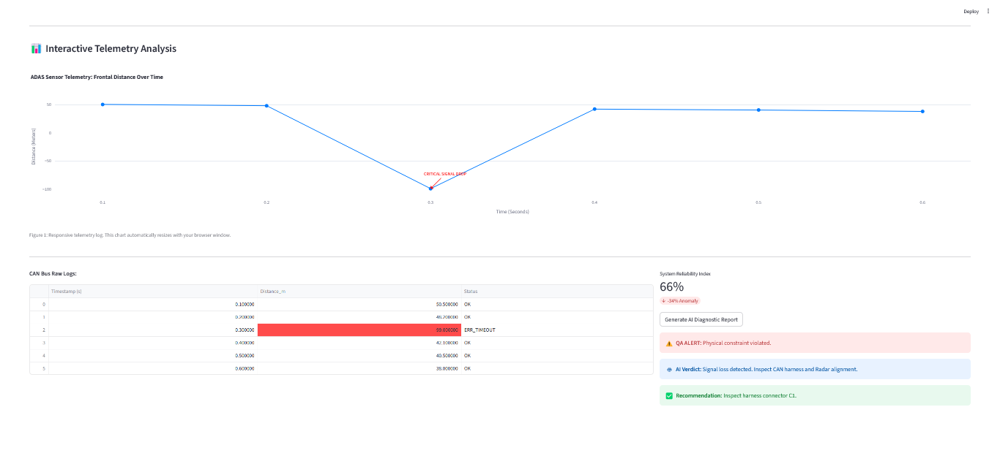

# SmartCAN Analyzer: AI-Powered ADAS Validation Tool 🚗🤖

## 🎯 Project Overview
This tool automates the identification of anomalies in **ADAS (Advanced Driver Assistance Systems)** telemetry. It uses a custom **QA Layer** to validate physical constraints and **AI (LLM/RAG)** to generate technical diagnostic reports for engineering teams.

## 📊 Dashboard Preview
*(The image below displays the interactive dashboard and AI analysis results)*

---

## 🛠️ Key Features
- **Responsive Telemetry**: Real-time signal visualization using Plotly.
- **Deterministic QA**: Python logic to catch sensor dropouts (e.g., -99m readings).
- **AI-Driven Verdicts**: Automated root-cause analysis based on technical manuals.

## 💻 Tech Stack
- **Backend**: Python 3.12 (Object-Oriented Programming)
- **Frontend**: Streamlit & Plotly
- **AI**: Gemini API Integration (Simulated)

## ⚙️ How to Run
1. `pip install pandas streamlit plotly`
2. `streamlit run app.py`